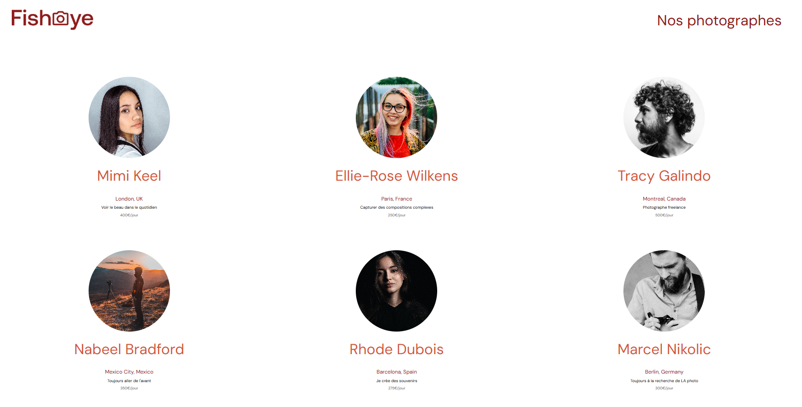

# Fisheye — Site accessible pour une plateforme de photographes

Projet **P6** de la formation **Développeur d'application JavaScript React** (OpenClassroom). Site vitrine présentant une sélection de photographes et leurs portfolios, avec une forte priorité à l’**accessibilité** (navigation au clavier, lecteur d’écran, ARIA).

---

## Présentation du projet



**Fisheye** est une maquette de plateforme permettant de :
- Consulter une **page d’accueil** avec la liste des photographes (nom, portrait, lieu, tagline, tarif).
- Accéder à une **page photographe** pour chaque talent : en-tête, galerie de médias (photos/vidéos), tri (popularité, date, titre), barre de likes et formulaire de contact.
- Ouvrir les médias en **lightbox** (navigation clavier, focus trap, fermeture à l’Escape).
- Ouvrir une **modale de contact** (formulaire labellisé, focus trap, fermeture à l’Escape).

Le site est entièrement utilisable **au clavier** et conçu pour être compatible avec les **lecteurs d’écran** (ARIA, sémantique, lien d’évitement).

---

## Fonctionnalités

| Fonctionnalité | Description |
|----------------|-------------|
| **Page d’accueil** | Liste des photographes sous forme de cartes cliquables menant à leur page. |
| **Page photographe** | En-tête (nom, lieu, tagline, portrait, bouton contact), galerie de médias, tri (Popularité / Date / Titre), barre fixe (total des likes + tarif). |
| **Lightbox** | Affichage d’un média en grand (image ou vidéo), navigation Précédent/Suivant (boutons + flèches clavier), fermeture par overlay, bouton ou Escape. |
| **Modale de contact** | Formulaire (prénom, nom, email, message) avec labels, validation et message de confirmation. |
| **Accessibilité** | Lien « Passer au contenu », focus visible, landmarks, `aria-label` / `aria-live`, focus trap dans modale et lightbox, préférences `prefers-reduced-motion` et `prefers-contrast`. |

---

## Technologies

- **HTML5** (sémantique, landmarks, formulaires accessibles)
- **CSS3** (variables, flexbox/grid, responsive, thème d’accessibilité)
- **JavaScript** vanilla (modules chargés par scripts, pas de framework)
- **ESLint** pour la qualité du code (`npm run lint`)

---

## Structure du projet

```
.
├── index.html              # Page d’accueil
├── photographer.html       # Page détail photographe
├── data/
│   └── photographers.json  # Données (photographes + médias)
├── assets/
│   ├── images/             # Logo
│   ├── photographers/      # Portraits
│   └── photos/             # Médias par photographe (Ellie Rose, Marcel, etc.)
├── css/
│   ├── base/               # reset, variables, typo, accessibilité, layout
│   ├── composants/         # boutons, cartes, header, lightbox, modal, etc.
│   └── pages/              # index.css, photographer.css
├── scripts/
│   ├── pages/              # index.js, photographer.js (logique de page)
│   ├── templates/          # photographer.js, media.js (cartes DOM)
│   └── utils/              # lightbox.js, contactForm.js, loader.js
├── .eslintrc.json
└── package.json
```

---

## Installation et lancement

### Utilisation simple (sans Node.js)

1. Cloner ou télécharger le projet.
2. Ouvrir `index.html` dans un navigateur (ou servir le dossier avec un serveur local si besoin pour le `fetch` selon la config).

### Avec Node.js (pour le linter)

```bash
# À la racine du dépôt (si package.json à la racine)
npm install
npm run lint

# Ou dans le dossier du projet Fisheye
cd Front-End-Fisheye---OpenClassRoom---FOUGEROUSE-Elodie-
npm install
npm run lint
```

- **`npm run lint`** : vérifie le code JavaScript avec ESLint.
- **`npm run lint:fix`** : applique les corrections automatiques lorsque c’est possible.

---

## Données

Les profils et médias sont chargés depuis **`data/photographers.json`** :
- **`photographers`** : tableau des photographes (id, name, portrait, city, country, tagline, price, etc.).
- **`media`** : tableau des médias (id, photographerId, title, image ou video, likes, date, etc.).

La page photographe récupère l’`id` dans l’URL (`?id=...`) et filtre les médias par `photographerId`.

---

## Accessibilité (résumé)

- **Lien d’évitement** : « Passer au contenu » (visible au focus).
- **Focus visible** : outline sur les éléments interactifs (`:focus-visible`).
- **Landmarks** : `role="banner"`, `role="main"`, zones avec `aria-label`.
- **Modale et lightbox** : `role="dialog"`, `aria-modal`, focus trap (Tab reste dans la fenêtre), fermeture à l’Escape, retour du focus à la fermeture.
- **Formulaire** : labels associés, `aria-labelledby`, champs requis.
- **Tri** : `<label for="sort-select">` et `aria-labelledby` sur le select.
- **Préférences utilisateur** : `prefers-reduced-motion`, `prefers-contrast` (dans `css/base/accessibility.css`).

---

## Auteur

Projet réalisé dans le cadre du **Projet 6 - Créez un site accessible pour une plateforme de photographes - Formation Développeur d'application JavaScript React**, OpenClassroom.
